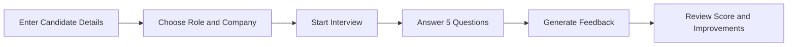

<div align="center">

# 🎤 AI Interview Chatbot

### A smart, interactive interview simulator built with Streamlit and OpenAI

Prepare for interviews through a personalized five-question experience, receive structured feedback, and identify areas for improvement.

<br>


</div>

---

## ✨ Overview

**AI Interview Chatbot** is a Streamlit application that simulates a personalized HR interview.

The chatbot uses the candidate's background, target seniority, position, and company to generate relevant follow-up questions. After five questions, it evaluates the full conversation and provides an overall score with constructive feedback.

---

## 🚀 Key Features

- 👤 Personalized interview setup
- 🏢 Company and role selection
- 📊 Junior, Mid-Level, and Senior interview levels
- 🔢 Five-question interview flow
- ✅ Question counters such as `[2/5]`
- 🏁 Clear **One Final Question** indicator
- 🧠 Context-aware follow-up questions
- 📋 Automated performance feedback
- ⭐ Overall interview score from 1 to 10
- 🔄 Restart interview functionality
- 💾 Streamlit session-state management

---

## 🎬 How It Works



1. Enter your name, experience, and skills.
2. Choose your seniority level, target position, and company.
3. Complete a five-question AI-generated interview.
4. Review your overall score and personalized feedback.
5. Restart the interview and try again.

---

## 🖥️ Interview Experience

Each question and answer displays a progress counter:

```text
[1/5] Start by introducing yourself.

[2/5] Tell me about a recent project you worked on.

...

[5/5] One Final Question
Where do you see yourself progressing in this role?
```

---

## 🧰 Tech Stack

| Technology | Purpose |
|---|---|
| Python | Core application logic |
| Streamlit | User interface and session management |
| OpenAI API | Interview questions and feedback generation |
| streamlit-js-eval | Browser refresh functionality |

---

## 📁 Project Structure

```text
AI-Interview-Chatbot/
│
├── app.py
├── README.md
├── LICENSE
├── requirements.txt
├── .gitignore
│
└── .streamlit/
    └── secrets.toml
```

## ▶️ Run the Application

```bash
python -m streamlit run app.py
```

The app should open automatically in your browser.

Default local address:

```text
http://localhost:8501
```

---

## 🎯 Supported Interview Options

### Seniority Levels

- Junior
- Mid-Level
- Senior

### Positions

- Data Scientist
- Data Engineer
- ML Engineer
- BI Analyst
- Financial Analyst

### Companies

- Amazon
- Meta
- IBM
- Google
- LinkedIn
- Spotify

---

## 🧠 Session State

The app uses `st.session_state` to preserve:

- Candidate information
- Selected interview settings
- Conversation history
- Current question number
- Interview completion status
- Feedback visibility

---


## 📄 License

This project is licensed under the **MIT License**.

See the [LICENSE](LICENSE) file for more information.

---

<div align="center">

### Built with Python, Streamlit, and OpenAI

</div>
